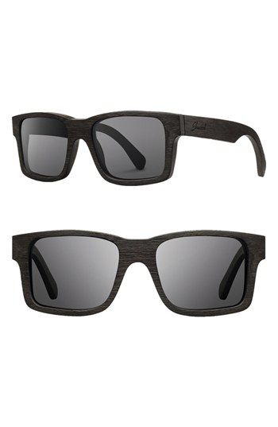
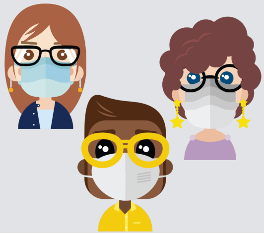

# Personal Information 

  My name is Phimonrat Panaphong, and my nickname is Belle, I am originally from Bangkok, Thailand, 
who currently lives in Sydney, Australia. I am 37-year-old, and I am Buddhism. I graduated 
Bachelor's degree in international business management from Thailand and had completed a Diploma of 
Business Management in Sydney. I speak Thai, English and Spanish (relatively). I enjoy cooking, baking, 
listening to music, watching Korean drama, and re-arranging and organising wardrobe. I am Sagittarius, 
and I am fair-minded, optimistic, hilarious, spontaneous, and honest.

   I'm married to Ecuadorian-Australian, who brings laughter to the family. We have two gorgeous girls. 
They are 3 and 5 year old. My current goal is to finish a Bachelor of IT and build my IT career and at 
the same time try my best to be the mom, student and wife.

# Interest in IT

* What is your interest in IT? When did your interest in IT start? 
Was there a particular event or person that sparked your interest? 
Outline your ITexperience

   During the lockdown, my husband got an identification stolen. He could not access to his emails 
and could not use his phone. We found out later that someone in Tasmania requested for his phone SIM 
card replacement. That moment I thought if I have a piece of adequate knowledge about IT or 
at least know how the hacker penetrates. My husband would not experience the challenging time and 
terrified that someone will steal our finance or commit fraud under his identity.  

* Why did you choose to come to RMIT?

  According to the story above, I started to look for suitable options and flexible courses. 
I found RMIT through Open University, and when I found out that RMIT offers a 100% online 
bachelor's degree in IT. I cannot let go of this opportunity, and here I am!

* What do you expect to learn during your studies?

   I am a new IT learner, and I do have little technical knowledge. I expect to learn more 
about creating a website and comprehensive hardware and software functionality, including 
cloud storage. Learning more about coding and programming would be a great benefit to 
a future career as well.  

# Ideal Job

   The job advertisement itself. Include a link, and a snapshot of it (in case the link expires
before the assignment deadline).

<https://www.seek.com.au/job/51091574?type=standard#searchRequestToken=ffefc628-6c32-4faa-bbc3-8b41204090d1>

   This position is appealing to me because I am familiar with Business Management and proficient in Microsoft excel. 
The possibility that I will get promoted to Senior System Analyst. Furthermore, the role that advertised need someone 
who can perform application and system support. That makes it remarkably interesting to work there, and the job seems challenging. 

   This job requires managing, planning, analytical and technical knowledge skill. I need to learn more in System Support, 
Microsoft Excel, ERP and SQL scripts. 
 
   I have management, organising and planning skills. I have a Business Management Degree and four years' experience 
as a secretary and six years' experience as a casual Personal Assistant. Proficiently in Microsoft office and rapid learner. 
I am resilient, spontaneous, and ambitious. 
   
   Firstly, researching and understanding the company (Perigon Group Pty Limited) products. Then, I need to learn how to operate 
the ERP (Enterprise Resource Planning) and SQL scripts software. Lastly, I need to keep practising System Support and doing some 
more research about IT.

# Personal Profile
 
* The results of an online Myers-Briggs test. www.16personalities.com

* The results of an online learning style test

* The results of one further online test of your choosing

   These results are aiding me in achieving a better learning outcome. I never knew before that I could be an Auditory 
who is better at listening than reading material. I will use the guideline above to help me get through this degree.
Furthermore, the 1 result has given me a not positive outcome. I need to control myself in judging others and try to push myself more. 

   The test results 1 and 3 show me that I could be given a good suggestion and provide creative ideas toward group assignment. 
However, I need to work collaboratively with others to improve the innovative ideas.  
  
   The test results will help in a team forming by indicating an individual skill and talent. The team goal then generally 
clear to members, initial questions and concerns are addressed, and initial role assignments may develop. 

# Project Idea

## Overview

   Eyewear is an essential item for those who have visual problems, but we could make eyewear for medical use. What will it be? 
Will it be for x-ray and detect small lung cancer? Or will it be a weaponise glasses that work like 007?  I want to introduce the 
body temperature detecting glasses to be called CV2020. These glasses made to detect the human body temperature from 36.5c to 42.0c. 
This eyewear is hoping to help minimise the risk of contracting a novel virus called SARS-CoV-2 or Covid-19 and increase awareness in 
our community. The glasses made of 100% natural pinewood, recycle material and environment friendly. It comes in a variety of styles 
and colours.

## Motivation

   In early of 2020, the novel virus called Covid 19 was introduced to us by surprise. The pandemic started late 2019 and keep 
continuing until now. The virus has spread worldwide, killing at least 1.6 million people, including more than 300,000 in 
the United States and around 1,000 in Australia. The virus transmission is through close contact, including hug, kiss, touch and 
respiratory. The main symptoms are fever, shortness of breath, sore throat, and coughing with an incubation period of 4 – 7 days, 
with a range of 1 – 14 days. Most people who are infected will develop symptoms within 14 days of infection. All the scientists 
look for vaccination to cure this virus, but it's undergoing and in a trial period. 

This time being, we need to look after ourselves by keeping our hands hygiene and eating healthy. Moreover, wearing the genius CV2020 
will help notify when you are in close contact with someone with a fever of 37.4c or more. 

## Description

   Body temperature detecting wooden glasses is to be called CV2020, modified from the traditional hand-held thermometer but with 
a developed 5 meters measuring distance. It is an advance technology that developed for preventing the virus cross-infection. The device is
using an uncooled infrared thermal sensor between 36.5c to 42.0c CV2020 is safe and efficient because of its unique way of detecting 
temperature without physical touch. It is lightweight and comfortable to wear and comes in variety and colour. This thermometer can give 
a speedy result in 10 milliseconds.

   The glasses lenses design for prolonging wearing with a switch to reduce your eyes' discomfort and side switch the lenses by using 
your clean fingers. It works like touchscreen devices. You can even choose between prescription glasses or sunglasses. The battery-operated 
is chargeable through type C USB cable connect; DC 5V, 2A; Recharge in 1 hour and can be used up to 5 hours once fully charged. A solar 
charger sale separately.

   With a genius sensor, the glasses turned on and activated as soon as you put it on. This thermometer detector can be connected 
to your smartphone or smartwatch to track how many people with fever in that area you are. To minimise the risk of contracting the virus. 
Moreover, these include some unique features, such as weather forecast, reminder, and messages once connected to a smartphone or smartwatch.

   The three layers lenses provide shade protection from sunray UV when needed, and genius bottom command switch on and off on the glasses 
left temple. This product come with two years warranty and free cleaning after one year of use.

## Tools and Technologies

  CV2020 runs with a chargeable battery and operate with PC software analysis. Using the infrared technology with a resolution 
of 16x120 and lenses resolution is 400x250 with power consumption less than 500mW5. It's using 5.2 Bluetooth compatibilities. 
The glass frame made of pine wood which water and dust resistant and environmentally friendly. CV2020 uses an infrared thermometer 
or a none contact laser thermometer that provides a piece of accurate information.

## Skills Required

• Glasses terminology knowledge
• Pinewood and how to assemble
• Graphic design
• PC software analysis
• Bluetooth installation
• Infrared installation

The skills, hardware, and software above are possible to find and can adapt from the available glasses. The pinewood and how to 
assemble can obtain it from a go green glasses' factory in Southeast Asia. 

CV2020 modified from the hand-held thermometer, the feasible of finding software and skills to make this CV2020 is highly possible.

## Outcome

  If the project is successful, the virus spread will decrease, and fewer people will be contracting, and hopefully, 
everything will come back to normal. This project will save lives and the possibility to meliorate the product to be more advance, 
such as used for detecting cancer, HIV, heart failure and so on.

   The con this project might have is, people, some human being might use it for a negative intension and for a criminal purpose, 
such as, use the glasses to detect someone in the car to steal the car, or steal glasses and check the store data that link to 
a smartphone or smart watch etc.

## References

Australian Government Department of health 2020, ***Coronavirus (covid-19) health alert***,
Commonwealth of Australia, viewed 14 December 2020,
<https://www.health.gov.au/news/health-alerts/COVID_19J4H0kdsd3TWrBoCZm4QAvD_BwE>

Instructables workshop 2020, ***Techniques for Making Wooden Glasses DIY***, Autodesk Inc,
viewed 20 December 2020, <https://www.instructables.com/Techniques-for-Making-Wooden-Glasses-DIY/>
